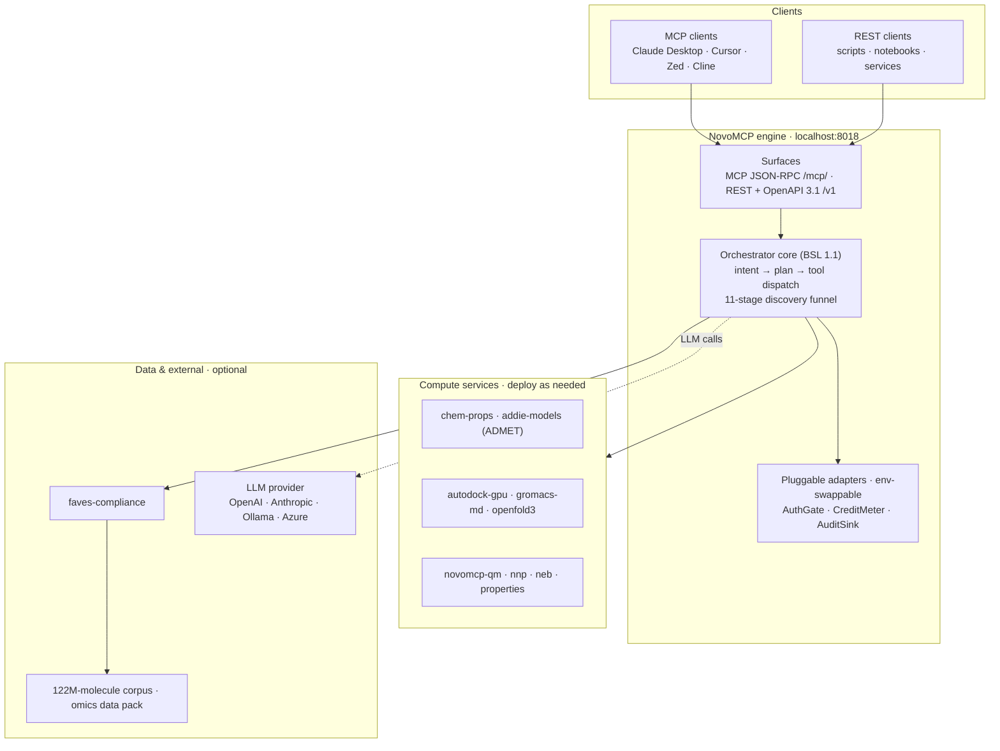

# Architecture

How the engine fits together — and what talks to what when you make a tool call.

NovoMCP is a single engine that exposes molecular intelligence through two surfaces, backed by optional compute services and data. Everything below the engine is pluggable or optional; the engine runs on its own on a laptop with none of it wired.

## The four layers

**Clients.** Anything that speaks MCP or HTTP. MCP-compatible assistants (Claude Desktop, Cursor, Zed, Cline) connect to the JSON-RPC surface; scripts, notebooks, and services hit the REST surface. Same tool catalog either way.

**The engine.** One process (`localhost:8018` by default). It has two surfaces over one core:

- **Surfaces** — MCP JSON-RPC at `/mcp/` and a curated REST API + OpenAPI 3.1 spec at `/v1`. Both routes land in the same orchestrator, so a tool behaves identically whether an agent calls it or a `curl` does.
- **Orchestrator core** — intent recognition, orchestration planning, semantic tool search, and the governed 11-stage discovery funnel. This is the part licensed under BSL 1.1 (see [Licensing](index.md#licensing)); everything around it is Apache-2.0.
- **Pluggable adapters** — `AuthGate`, `CreditMeter`, and `AuditSink` swap via environment variables. The OSS defaults are `LocalAuthGate` (every request is an unlimited `local` user), `NoopMeter` (no credit accounting), and `FileAuditSink` (appends to `~/.novo/audit.jsonl`). Swap them to run the same core authenticated, metered, and audited in production.

**Compute services.** Each heavy capability is a separate service you deploy when you need it — CPU services like `chem-props` and `addie-models`, GPU services like `autodock-gpu`, `gromacs-md`, and `openfold3`, and the native `novomcp-qm` / `nnp` / `neb` / `properties` stack. The engine dispatches to whichever are wired and reports the rest as unavailable rather than failing. See [Deploying services](deploying-services/README.md).

**Data & external.** All optional. `faves-compliance` serves regulatory screening and cached lookups against the enriched corpus; the 122M-molecule corpus and omics data pack are downloadable datasets you point the engine at; the LLM provider (used for intent recognition and planning) is your own key. None are required to boot.

## What runs with nothing wired

Out of the 67-tool catalog, **11 tools work fully local** the moment the engine boots — molecular profiling and cheminformatics computed in-process via RDKit, plus the MCP handshake and funnel protocol. No compute services, no data pack, no LLM key, no cloud. See [Tool availability](tool-availability.md) for the exact map of what's on by default and what each service unlocks.

## What a tool call does

1. A client sends a request to a surface (`/mcp/` or `/v1`).
2. `AuthGate` resolves the caller (a `local` user, unauthenticated, in OSS defaults).
3. The core plans and dispatches to the right handler — computed in-process for local tools, or proxied to a compute service for the rest.
4. `CreditMeter` records usage (a no-op in OSS defaults).
5. `AuditSink` logs the call (`~/.novo/audit.jsonl` in OSS defaults).
6. The result returns on the same surface it came in on.

## Next

- **[Quickstart](quickstart.md)** — boot the engine and run the first calls
- **[Tool availability](tool-availability.md)** — the 11-local map and what each service adds
- **[Deploying services](deploying-services/README.md)** — wire up ADMET, docking, MD, structure prediction, QM
- **[Configuring LLM providers](configuring-llm.md)** — enable intent recognition and planning
